# David Williams — Portfolio

Three projects, one common thread: each started with a problem I wanted solved.

- **A grant intelligence platform** I built for me and my colleagues at ServeMinnesota — replacing hours of manual cross-referencing with structured queries, and a web app that makes years of institutional knowledge quickly and deeply queryable for non-technical colleagues.
- **A value-alignment iOS app** that starts from what you value, helps you structure goals that reflect those values, and tracks the activities that support them — derived from a practice I've been using myself for over a year.
- **A pace-departure calculator** built for time blindness. Instead of "leave in 15 minutes," it shows the pace you'd need to arrive on time, updated live.

I'm a self-taught programmer with a Ph.D. in Philosophy. Each of the projects began from a workflow I was close enough to see clearly, and I use each one daily. Details about my background, stack, and how to reach me are at the bottom of this page.

## What's Here

### `grant-management-system/`

**A grant intelligence platform for a team managing a public-funding portfolio.**

Before this system, answering "which funders support literacy programs in Hennepin County?" meant hours of manual cross-referencing across a CRM, a spreadsheet, and a shared drive full of nested folders. Preparing for a funder meeting meant opening six tabs and hoping you remembered which subfolder had last year's report. Prospecting meant gut instinct and institutional memory.

GMS is the latest chapter of a longer story. Over my first three years on the team I built a succession of tools to make our work easier — a common-frameworks Word document (the *Enchiridion*) that tried to gather the organization's reusable language in one place; a shared Google Sheet to coordinate the writing schedule with our CRM; a growing collection of frameworks and templates. Each helped, and each showed the same limit: they could hold language, but they couldn't answer a question. What we actually needed was what I described in my last performance review — *"a single source of truth, if we could count on it being always up to date and easy enough to use that it would always be kept up to date."*

Starting in 2025, I began learning the tools to build that — JavaScript, then Python, SQL, and Flask, on my own time and in parallel with the day job. The bulk of the work has been on the data side: modeling the domain honestly so that four source systems with four vocabularies can be joined without flattening what makes each of them different. The web app sits on top of that model, translating the questions colleagues actually ask into queries they don't have to write.

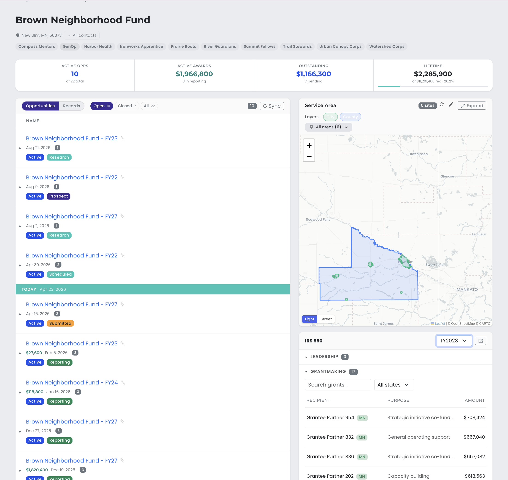

*An organization page: lifetime giving, open and closed opportunities, the funder's geographic service area, and their IRS 990 grantmaking history — all in one view.*

> **About the screenshots and data shown here.** Names, dollar amounts, addresses, and documents in the images below comes from a synthetic mock dataset. Geographic polygons are from publicly available TIGER/Line boundaries. Nothing in these screenshots represents my employer's operational data, real funders, or real grant outcomes. The mock exists so the application can be demonstrated without exposing any production information.

#### What it does

The system consolidates grant data from four sources — Google Sheets task tracking, a Bloomerang CRM, thousands of documents on a shared drive, and IRS 990 filings — into a single SQLite database with full-text search, geospatial queries, and analytical views.

A development officer uses it to:
- Search across thousands of narrative documents by keyword and see highlighted snippets
- Ask which funders have historically supported a specific program area, and how much they gave
- Map service sites against funder territories to find geographic alignment
- See team workload distribution, deadline heatmaps, and win rates by fiscal year
- Track the full lifecycle of an opportunity from prospect through award to report

A program director or executive can use the same data for a different purpose — portfolio concentration analysis, pipeline value against fiscal-year targets, win rates year over year — without needing a custom report. The Pareto view at the bottom of the walkthrough is one example: the chart and the SQL that produced it are displayed side by side so the user can see exactly what claim is being made. This pattern is currently a development convenience, but I expect it to be useful for non-technical analysts who want to see — and sometimes tweak — the underlying logic.

#### A walkthrough

| | |
|---|---|
| 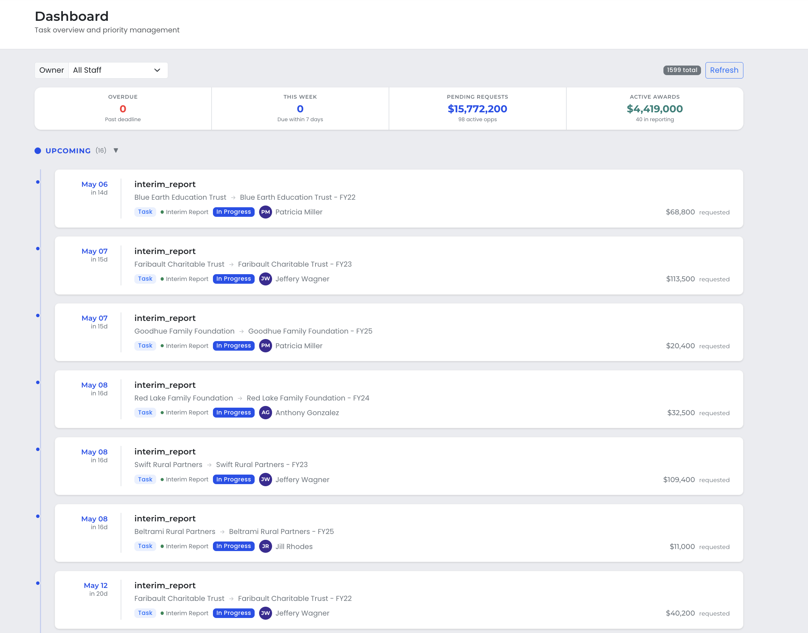 | **Dashboard.** Tasks across the active pipeline, ordered by deadline. The header totals summarize pending requests and active awards so the team starts each day with a single view of where their attention needs to go. |
| 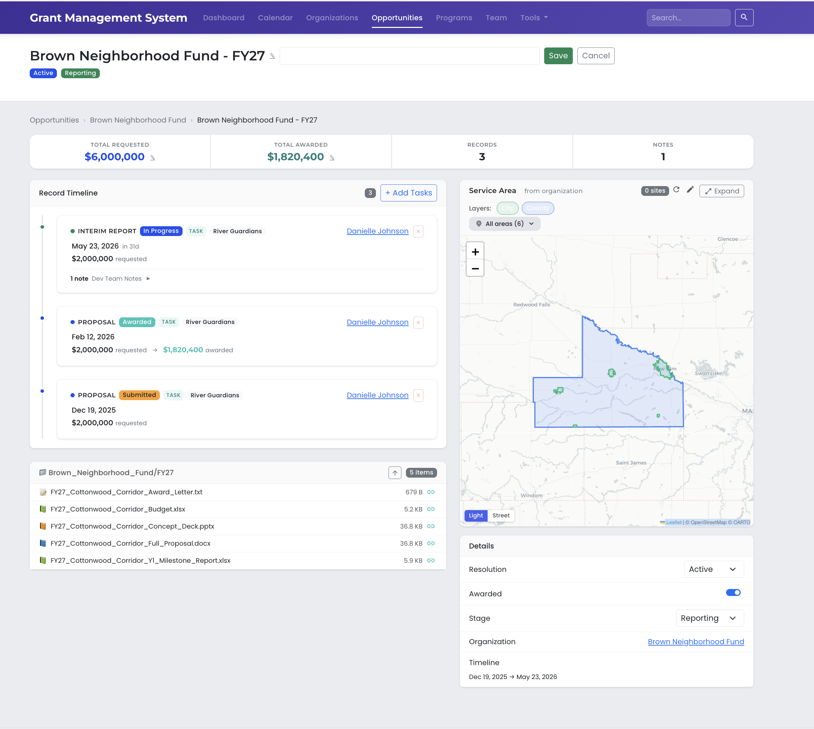 | **A funded opportunity, stitched across sources.** The record timeline shows proposal submitted → awarded → interim report, each row originating in a different system. The file drawer on the left is the matching folder from the shared drive, linked to the opportunity automatically. |
| 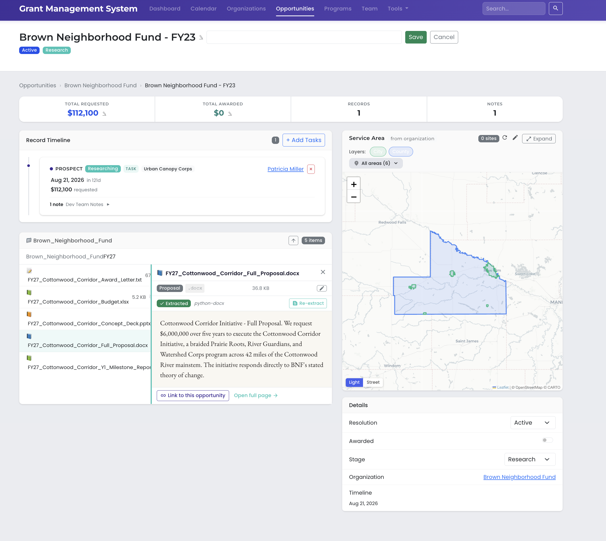 | **A prospect under evaluation.** The same layout, earlier in the lifecycle: a concept memo extracted from a proposal draft shows on the right, along with the funder's service area, to help decide whether to pursue. |
| 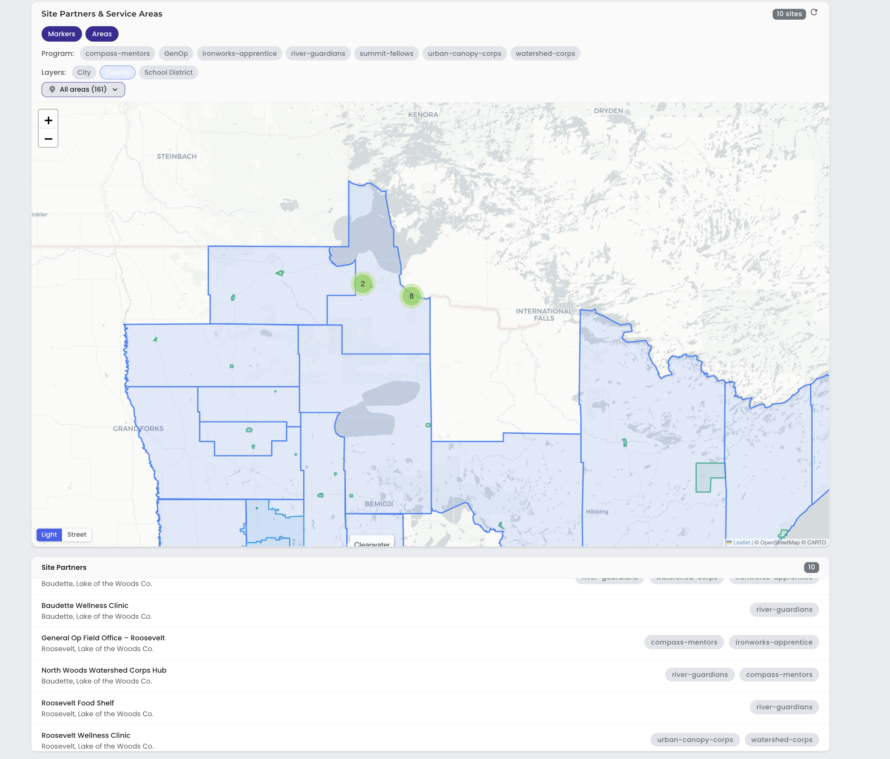 | **Geographic alignment.** Service-site locations rendered against funder territory polygons. Click a county cluster to see which partners sit inside a specific funder's footprint — useful for prospecting and for fit arguments in proposals. |
| 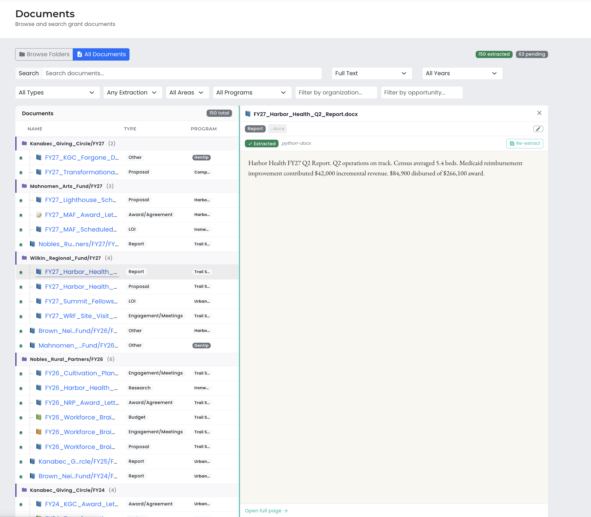 | **Full-text search across the document corpus.** Every PDF, .docx, .xlsx, and .pptx in the shared drive is text-extracted and indexed. Previews render inline so the user rarely needs to open a file to find what they're looking for. |
| 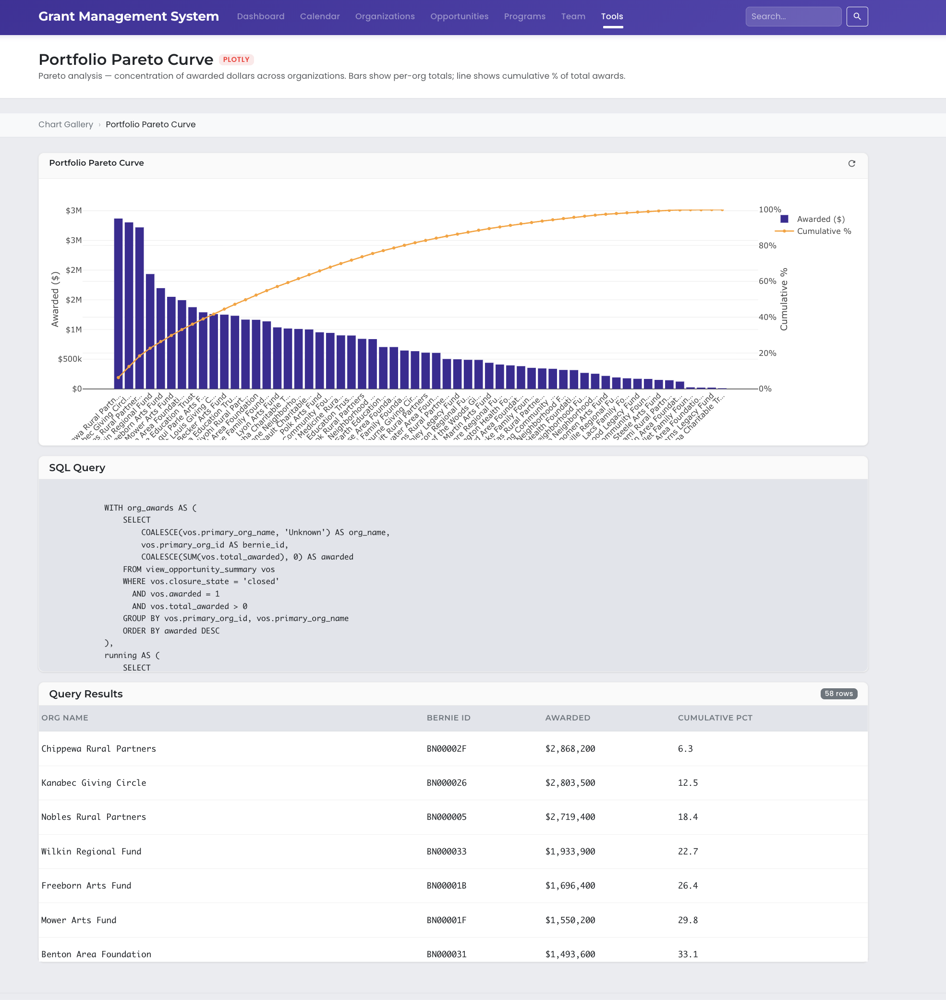 | **An analytical view with its query.** The Pareto curve shows portfolio concentration — the top handful of funders account for most awarded dollars. The SQL that produced it sits directly beneath, so the reader can see exactly what the chart is claiming. |

Additional views: [opportunities list](grant-management-system/screenshots/02-opportunities-list.png), [team workload analysis](grant-management-system/screenshots/06-team-workload.png), [document browser](grant-management-system/screenshots/08-documents-browser.png).

#### The core design problem

The four source systems use different vocabularies, different structures, and different identifiers for the same things. A funder might appear as "Gates Foundation" in the spreadsheet, "Bill & Melinda Gates Foundation" in the CRM, and live inside a folder called `Gates_2025/`. A proposal status might be "1. Awarded" in one system and "awarded" in another. A single grant application can span a task-tracker row, three CRM interaction notes, a folder of drafts, and an eventual award letter — none of which know about each other.

The system's job is to make those related records *act* like one thing without flattening the differences between them.

The approach is **config-driven** rather than code-driven. Field mappings, status translations, and program lookups live in database tables. Adding a new source means adding rows, not writing Python. The same ETL SQL handles every source because the variation is all in the config.

On top of the normalized facts, **domain entities** provide the business model. Organizations have canonical identities with alias resolution. Opportunities group related records across systems. The database enforces these relationships; the application code trusts them.

#### Architecture highlights

The two ideas most worth calling out:

**Two-tier fact table pattern.** Every record from every source becomes a header row plus a small set of child rows (titles, statuses, dates, amounts, programs, notes). A CRM interaction and a Writing Schedule task look nothing alike as source shapes, but they normalize into the same hierarchy. New sources don't require schema changes; nullable columns don't accumulate; queries against the header table work across everything.

**SQL views as the structural contract between database and application.** All multi-table reads go through views. A Python `ViewTable` class fuses the typed dataclass and the SQL metadata into a single declaration — column mismatches are caught at construction time, not at query time. The composable `Query` builder and `ColRef` DSL then let analytical code reference columns symbolically instead of by string.

**Stack:** Python 3.12, Flask, SQLite (WAL mode), SpatiaLite, Jinja2, Alpine.js, Plotly, Leaflet

#### What I'm working on next

The structured data layer solves one half of the problem — records and their relationships. The other half lives inside the narrative documents themselves: mission statements, theories of change, outcome evidence, program descriptions, refined over a decade by dozens of colleagues across hundreds of proposals and reports. I've created a pipeline that allows for efficient full-text search over that material, but this is still limited to keywords, lemmas, and stems. 

Before writing a new proposal, we review past work — to reconcile our language with the current state of our programs, to reuse what has already been refined, and to avoid re-answering questions that similar funders have asked before. Wording across proposals is different enough that a grantwriter responding to a new RFP typically has to remember which past proposal contained the best version of the most relevant answer. I've been working to reduce this cognitive overhead by extending the current system with natural language processing. I intend to make our institutional knowledge queryable by meaning, not just by surface wording.

The core problem is ontological. *"What is your mission statement,"* *"state your organizational mission,"* and *"briefly describe the purpose of your organization"* are three funders asking the same question. You and I know that; conveying that knowledge at the level of the data requires really understanding something durable about the question being asked. Until the system can represent that sameness, the answer stays scattered across a decade of submitted proposals in varying phrasings.

The plan:

1. **A taxonomy of recurring prompts** — funder questions clustered by the underlying thing being asked, not by surface wording.
2. **A canonical-answer registry** — for each prompt class, the current best version of our answer, with provenance back to the documents that refined it over time.
3. **Retrieval-augmented drafting** — given a new funder question, the system proposes the closest canonical answer, the three prior submissions it derives from, and a starting draft the writer can revise rather than write from scratch.

This is a direct continuation of the impulse behind GMS: make a decade of institutional knowledge legible and reusable, rather than locked in the muscle memory of whoever happens to still be on the team.

#### Explore further

- [`architecture.md`](grant-management-system/architecture.md) — system design, data model, query DSL, and design decisions
- [`etl-pipeline-overview.md`](grant-management-system/etl-pipeline-overview.md) — how data flows from raw sources to structured, searchable records
- [`sample-queries.sql`](grant-management-system/sample-queries.sql) — analytical queries against the database, including the Pareto query shown above
- [`mock/generate_mock.py`](grant-management-system/mock/generate_mock.py) — the generator that produces the synthetic database used for these screenshots

### Happy to Have Lived

**A goal-planning app that starts with what matters, not what's due.**

Happy to Have Lived begins with values: what do you think is worthwhile? From there, you define goals that connect to those values, set time-boxed terms to focus your energy, and record actions — including imports from Apple Health. The Reflect tab shows how your values, goals, and actions connect, so you can see whether what you're doing aligns with what you care about.

#### Why this exists

The app is the codification of a practice I've been running on myself since spring 2025. Every ten weeks I set a small number of goals tied to a theme, track them, and review. Four terms in — *Exploratory*, *Writing, Body Stability, and More Programming*, *Mindfulness*, and the current *Early Spring* — the approach has held up well enough that I wanted to give it a proper home beyond a spreadsheet and a Dataview dashboard.

The design comes from what I noticed about my own habit apps and trackers: they were excellent at reminding me to do things, and uninformative about whether those things were worth doing. Happy to Have Lived inverts the order. The first question is "what do you value?" Goals descend from values, actions serve goals, and the Reflect tab closes the loop so the user can see whether the daily activity and the stated values are actually in the same room.

The ten-week term length is deliberate: long enough for real progress, short enough that the end is always visible. Each term is a chapter with a focus, not an open-ended to-do list.

#### How it works

The app is organized around four tabs:

- **Now** — Today's view. What's active, what needs attention, a daily greeting.
- **Plan** — Define values, set goals, create time-boxed terms. The facilitated start flow walks new users through articulating what matters before asking them to plan anything.
- **Record** — Log actions toward your goals. Import workouts from Apple Health so exercise counts as progress without manual entry.
- **Reflect** — See patterns. Value Connections shows which values your goals serve. Review past terms to understand what worked.

#### Screenshots

| Facilitated Start | Now | Plan | Reflect |
|:-:|:-:|:-:|:-:|
| 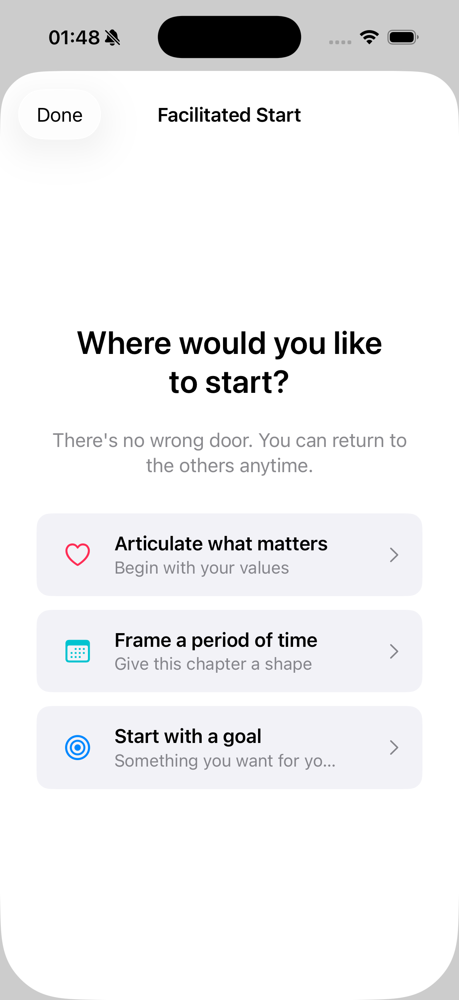 | 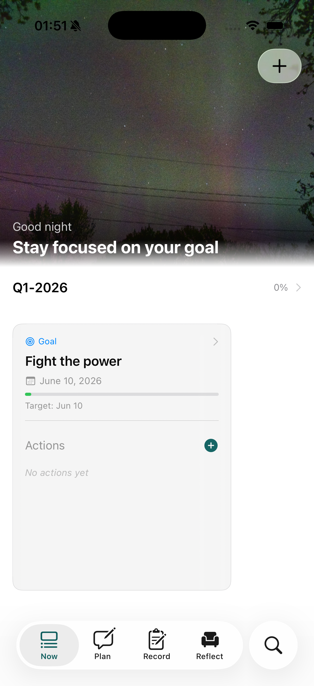 | 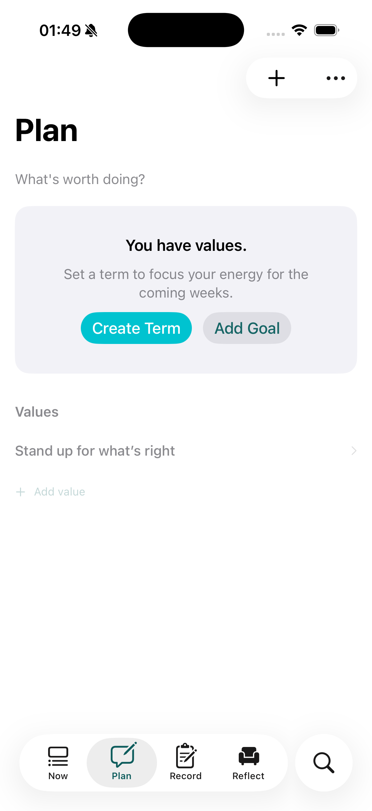 | 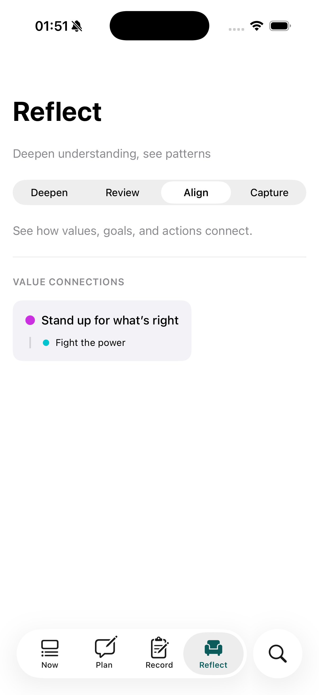 |
| Begin with what matters | Today's focus | Values → goals → terms | See how it connects |

| Values | Record |
|:-:|:-:|
| 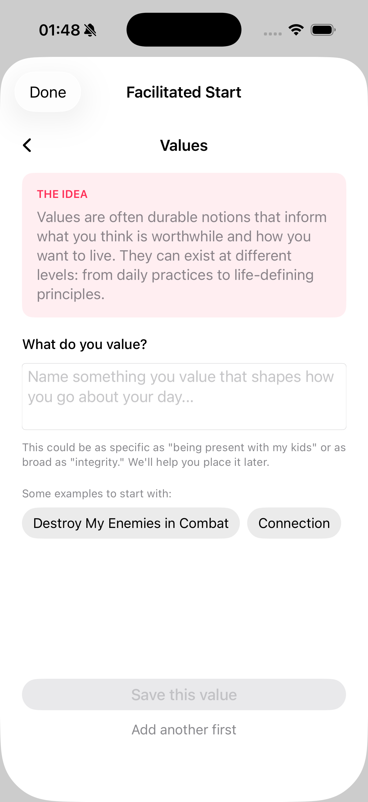 | 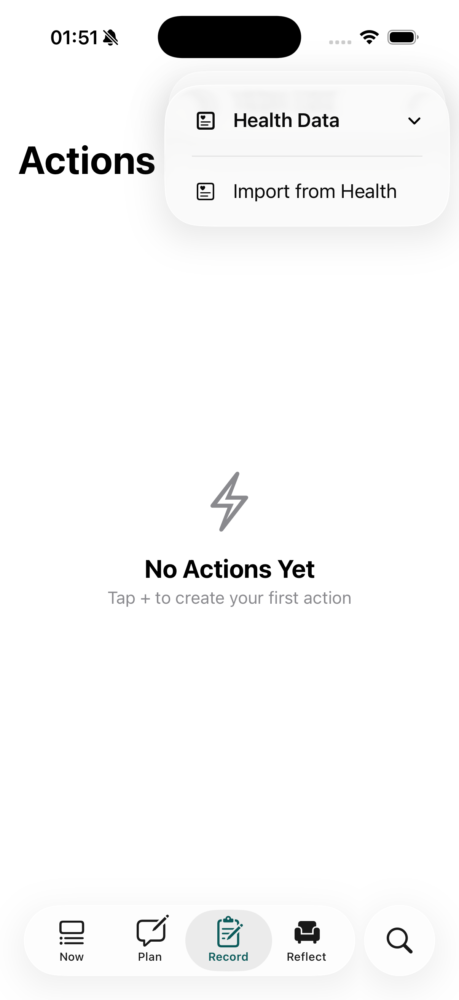 |
| Articulate what you value | Log actions, import from Health |

#### Architecture

This is the project where I went deep on Swift and domain modeling. Unlike RunningBehind (where I prioritized shipping), Happy to Have Lived is where I practiced building a real data model from first principles — asking what a goal actually *is*, what it means for a value to connect to an action, how to represent progress without flattening it into a percentage.

Three-layer Swift Package Manager structure with normalized SQLite models (via GRDB), a centralized `@Observable` DataStore that bridges database observation to SwiftUI, and on-device language generation via Apple Intelligence. The database pushes changes, the store holds state, views react automatically.

**Stack:** Swift 6.2, SwiftUI, GRDB, SQLite, HealthKit, Apple Intelligence (Foundation Models), AppIntents

Currently in active development toward v1.0. This app is approved for testing via Apple TestFlight: https://testflight.apple.com/join/rrpQRxYJ

### RunningBehind

**A departure calculator for people who lose track of time.**

Standard calendar alerts say "leave in 15 minutes."  For some of us, 15 minutes from now is a nebulous feeling of not-quite-now. RunningBehind answers a different question: What pace do I need to get there on time? It continuously recalculates as time passes, translating a countdown into something concrete and embodied.

#### Why this exists

Someone close to me lives with time blindness. The problem isn't not knowing when to leave — it's that "20 minutes" and "2 minutes" feel the same until it's two minutes too late. RunningBehind reframes departure as a physical relationship between your body and a destination. When the required pace shifts from "easy stroll" to "brisk walk" to "you'd better run," that's legible in a way a ticking number isn't.

#### How it works

You pick a destination and an arrival time. The app calculates a route, factors in your prep time (coat, keys, shoes) and arrival buffer (parking, elevator, finding the room), and tells you: *right now, you'd need to walk at 3.2 mph.* That number updates live. As time passes without you leaving, the pace climbs. Color-coded urgency — green, amber, red — makes the state immediately visible.

Once you depart, GPS tracking switches the display: now it shows your actual pace against the required pace, so you know if you're on track or need to pick it up.

**Key features:**
- Real-time pace calculation with urgency visualization
- Prep checklists with live time recalculation as you check items off
- Calendar integration — upcoming events surface as suggested destinations
- Custom travel modes (walking, cycling, driving) with per-mode speed units
- Live Activities on the lock screen during active journeys
- Journey history for reviewing patterns

#### Screenshots

| Departure | Destination | Modes | Modality Editor |
|:-:|:-:|:-:|:-:|
| 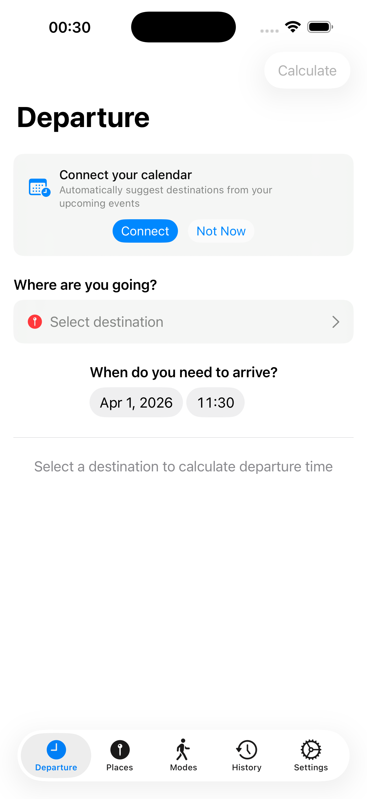 | 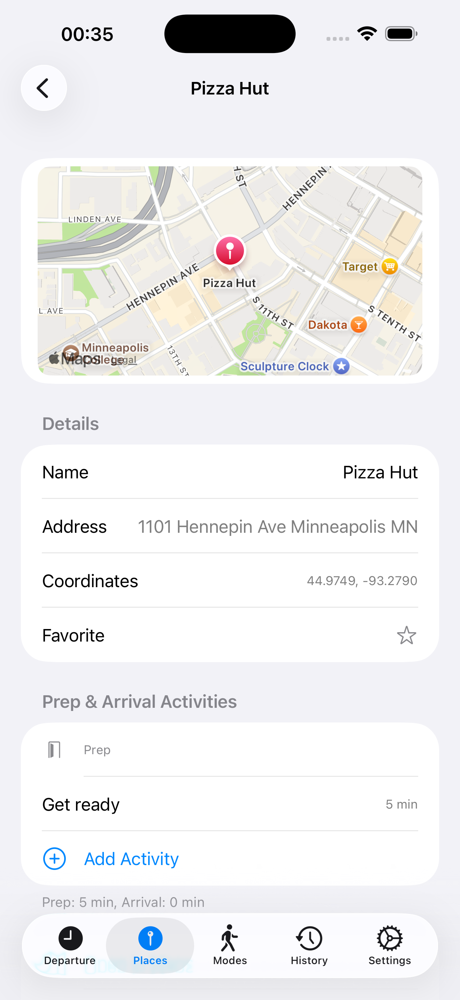 | 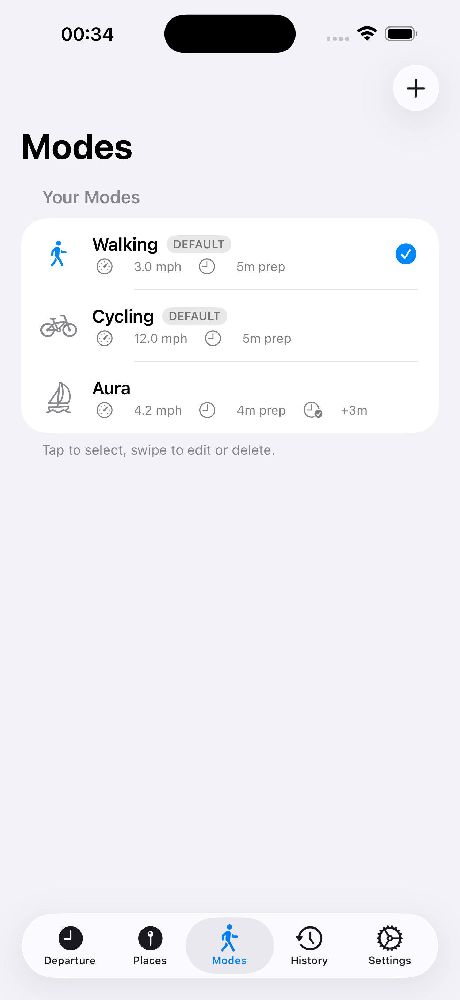 | 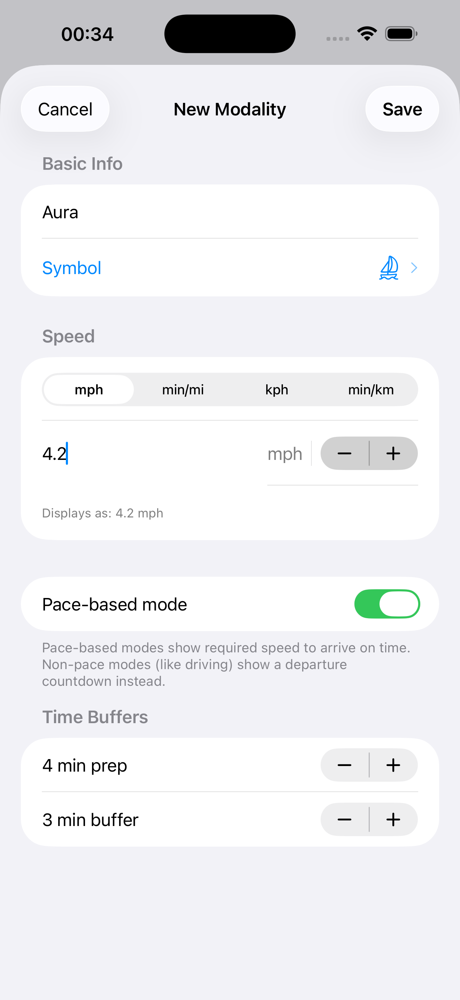 |

**Urgency progression** — the same trip as time passes:

| Relaxed | Time passing | Running late | Journey in progress |
|:-:|:-:|:-:|:-:|
| 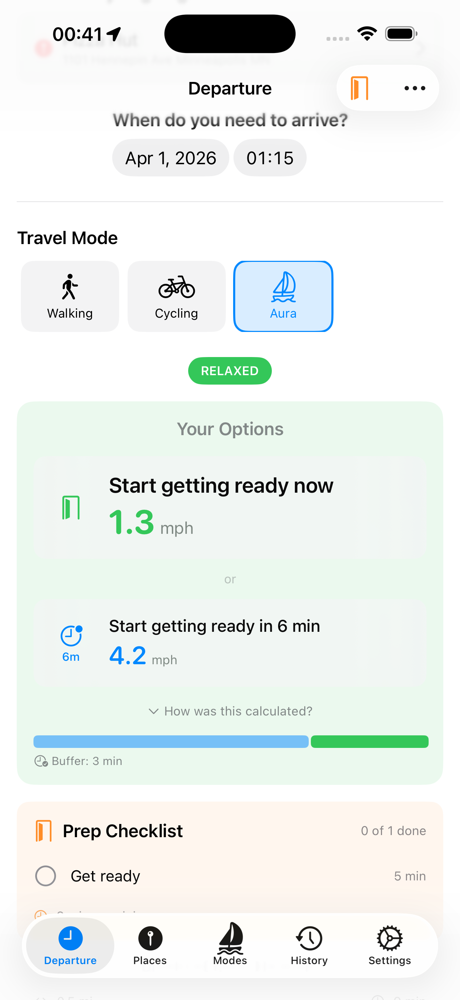 | 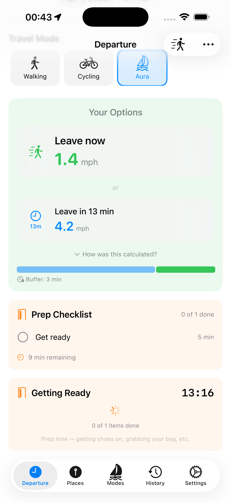 | 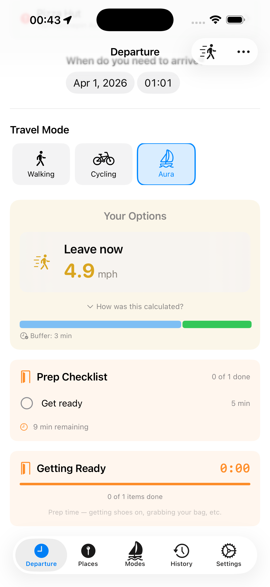 | 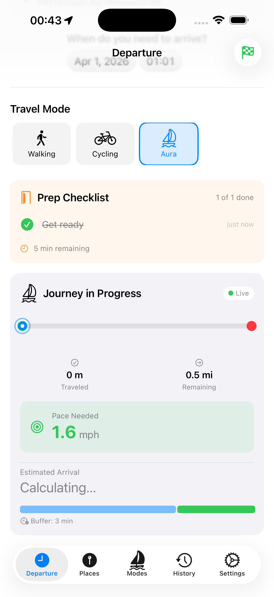 |
| 1.3 mph — plenty of time | 1.4 mph — options narrowing | 4.9 mph — you need to leave | Departed — live pace tracking |

#### Built with AI

RunningBehind was built primarily through prompting — Claude Code writing Swift while I focused on product decisions, scope discipline, and shipping. This was a deliberate choice: unlike the Grant Management System, where I went deep on architecture and data modeling, here the goal was to define a narrow feature set, get to the App Store, and learn what it takes to maintain a shipped product.

What I practiced: describing intent clearly enough to produce usable code, recognizing when generated code was structurally wrong even when it compiled, and saying no to features that didn't belong in v1.

The app is feature-complete and in testing. Currently used daily by the person I built it for.

**Stack:** Swift 6.2, SwiftUI, GRDB, SQLite, MapKit, CoreLocation, EventKit, ActivityKit

Read more: [`building-with-ai.md`](running-behind/building-with-ai.md) — prompting strategy, what I learned, and the user story

## Technical Stack

- **Languages** — Python, SQL, Swift
- **Backend and data** — Flask, SQLite, SpatiaLite, GRDB
- **iOS** — SwiftUI, HealthKit, AppIntents, ActivityKit, MapKit
- **Frontend** — Jinja2, Alpine.js, Plotly, Leaflet
- **AI-assisted development** — Claude Code in daily production use; prompting strategy and scope discipline

## About Me

I've been Development Manager at ServeMinnesota since 2021. The systematization instinct has been there from the beginning: first as Word documents and shared spreadsheets, then — starting in 2025 — as real tools. I taught myself JavaScript, then Python, SQL, and Flask; later Swift and domain-driven design. GMS is the fullest expression of that work so far.

My supervisor described the through-line in my 2025 review better than I could: *"I see your drive for learning and process improvement — regularly noticing pain points and asking yourself and others how we might adjust our processes to reduce those pain points and find better approaches."* The systems I build are infrastructure for team capability, not side projects. I also recognize my growing edge: thinking about structure can make simple things slow, and it's easy to get absorbed in a solution's internals when what's wanted is a plain explanation and a clear next step. I work on it.

In October 2024, I defended my Ph.D. in Philosophy at Johns Hopkins (*Six Attempts to Make Sense*). The philosophy background is part of how I approach software: I treat the vocabulary of a problem as something that deserves care before any code is written against it.

Native English, fluent French. Relocating to Geneva, Switzerland in 2026.

I learn domains by inhabiting problem spaces and asking questions; I build systems by modeling them honestly. My work sits at the intersection of data infrastructure, domain-driven design, and clear writing.

[LinkedIn](https://www.linkedin.com/in/williamsbdavid/) | williamsbdavid@gmail.com
