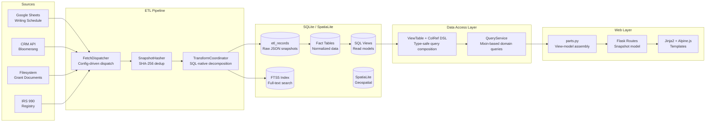
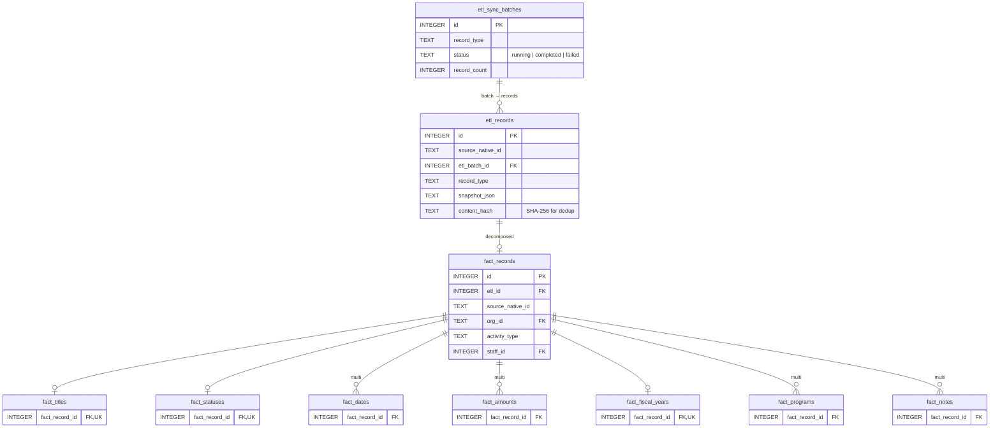

# Grant Management System — Architecture

A Flask/SQLite application that consolidates grant data from multiple sources into a unified analytical platform. Built as an internal tool for a nonprofit development team managing a $16M+ grant portfolio.

## Problem

We are a team of five managing relationships with hundreds of funders, composing hundreds of proposals and reports, and collaborating across organizations and across domains. We need to:

- Track deadlines, statuses, and dollar amounts from disparate source systems
- Search across tens of thousands of *narrative* documents
- Analyze and report on funding portfolio: win rates, funder concentration, staff workload
- Map service sites against funder territories using geospatial data

The existing workflow involves manual, ad-hoc cross-referencing between spreadsheets, a CRM, and a shared drive.


Three problems to address:

1. Multimodal tasks and preparation, in general, require context shifting that’s lossy, fragmented, and distractible.
2. Among multimodal task, reasoning about places is particularly lossy, fragmented, and distractible. 
3. Searching for, rediscovering, and repurposing preferred narrative documents is slow, lossy, and unstructured. 

These problems share some common properties: We have structured and semi-structured data that does not conform to a unified schema; we store data in systems and repositories that don’t automatically communicate or reconcile; we reference and don’t own a wide variety of data that is important for reasoning and decision-making within our roles; we have a mix of valuable historical data and continuously evolving new data — data that might have a different grain to historical data as well as entirely new forms of data that weren’t previously accessible to us.


## Architecture Overview



## Data Model

The schema uses a **two-tier fact table pattern**: a `fact_records` header row links to multiple child tables, each holding one aspect of the source record. This design allows for normalization (mitigating risk of various data anomolies) while also accomodating different field shapes without requiring schema changes per source.



**Why this shape?** A Google Sheets task has a deadline, a status, and an amount. A CRM interaction note has a date and text but no amount. A document has a path and extraction status. Rather than nullable columns for every possible field, child tables hold only the data that exists. Adding a new source means adding rows to `ref_field_routing` (which JSON keys map to which child tables) — reduced risk of schema migration.

### Domain Entities

On top of the fact layer, domain entities provide the business model:

- **Organizations** — canonical identity registry with alias resolution and IRS 990 linking
- **Opportunities** — curated groupings of related source records (e.g., one grant application may span multiple Writing Schedule tasks)
- **Staff** — team members with workload tracking
- **Programs** — organizational program areas linked to records via junction table
- **Documents** — filesystem scan results with text extraction and FTS5 indexing
- **Places** — SpatiaLite-backed geographic entities for territory mapping

## ETL Pipeline

The pipeline is config-driven. Adding a new data source requires only database rows — no Python changes. This also makes the application deployable to partners with similar business needs or as an open-sourced tool with community-supported maintenance. 

**Three modules, clean separation:**

| Module | Responsibility | Key Pattern |
|--------|---------------|-------------|
| `FetchDispatcher` | Route key → API call via `ref_fetch_config` table | Config-driven dispatch with pre-fetch ID resolution |
| `SnapshotHasher` | Raw dicts → `(native_id, type, json, hash)` tuples | SHA-256 of canonical JSON, excludes routing metadata |
| `TransformCoordinator` | Hashed tuples → fact tables in one transaction | Bulk `INSERT...SELECT...JOIN` on field routing tables |

## Query DSL: ViewTable + ColRef

Every SQL view is represented by a single Python class that serves three roles:

### 1. Frozen dataclass (typed row)

```python
@dataclass(frozen=True, slots=True)
class ViewRecord(ViewTable):
    _table: ClassVar[str] = "view_records"
    _alias: ClassVar[str] = "vr"
    _pk: ClassVar[str] = "source_native_id"

    fact_record_id: int
    source_native_id: str
    org_name: str | None
    status: str | None
    deadline: date | None
    amount_requested: Decimal | None
    # ... 20+ fields matching the SQL view columns
```

### 2. Column-reference DSL (type-safe SQL composition)

```python
class ColRef:
    """Wraps 'vr.deadline' with operator overloads → WhereClause objects."""

    def __eq__(self, other):
        if other is None:
            return WhereClause("vr.deadline IS NULL")
        return WhereClause("vr.deadline = ?", (other,))

    def __ge__(self, other):
        return WhereClause("vr.deadline >= ?", (other,))

    def like(self, pattern):
        return WhereClause("vr.deadline LIKE ?", (f"%{pattern}%",))

    def is_in(self, values):
        placeholders = ", ".join("?" for _ in values)
        return WhereClause(f"vr.deadline IN ({placeholders})", tuple(values))
```

`WhereClause` composes via `&` (AND) and `|` (OR):

```python
clause = (ViewRecord.c.status == "active") & (ViewRecord.c.deadline >= "2026-01-01")
clause.sql    # "(vr.status = ? AND vr.deadline >= ?)"
clause.params # ("active", "2026-01-01")
```

### 3. Immutable Query builder

```python
q = (Query.from_view(ViewRecord)
     .where(ViewRecord.c.status == "active")
     .order_by(ViewRecord.c.deadline.asc_nulls_last())
     .limit(25))

sql, params = q.build()
rows = q.fetch_as(conn, ViewRecord)  # Returns list[ViewRecord]
```

Each chaining method returns a new `Query` (frozen dataclass via `dataclasses.replace`), so partially-built queries are reusable base objects. The builder supports typed filters via ColRef, raw SQL escape hatches for complex expressions, JOINs, GROUP BY, and single-pass pagination with `COUNT(*) OVER()`.

**Why this matters:** Column typos are caught at construction time (when `ColRef` is created via `__init_subclass__`), not at SQL execution. The SQL view is the structural contract — if `view_records` returns the right columns, `ViewRecord.from_row()` produces the right typed object.

## Web Layer: Snapshot Model

Flask routes produce **snapshots** — a photograph of data at request time. There is no reactive binding, no subscriptions, no push.

The architecture has two layers of reuse connected at the route level:

- **Data shape reuse (Python):** `QueryService` methods return frozen dataclass DTOs. The same `list_records(filters=RecordFilters(staff_id=3))` serves the staff detail page, the dashboard filtered view, and the `/api/tasks?staff=3` endpoint.

- **Visual shape reuse (Jinja2):** Macros and partials render a given data shape identically across pages.

`parts.py` (38K) serves as the view-model layer — assembling context dicts from multiple QueryService calls. The same output feeds both Jinja templates and JSON API routes, preventing template/API divergence.

Alpine.js pages fetch from `/api/` endpoints rather than embedding server-rendered JSON, enabling a future path to polling or SSE push without architectural changes.

## Key Design Decisions

### Config-driven ETL over hardcoded source handlers

Every source-specific behavior (field mapping, status canonicalization, program translation) lives in database configuration tables, not Python code. `ref_field_routing` maps source JSON keys to app fields. `ref_status_mappings` and `ref_type_mappings` canonicalize source-specific vocabularies. The `TransformCoordinator`'s bulk SQL uses these as JOIN partners:

```sql
-- Dynamic JSON extraction via field routing table
SELECT fr.id, json_extract(er.snapshot_json, '$.' || rf.source_key)
FROM fact_records fr
JOIN etl_records er ON er.id = fr.etl_id
JOIN ref_field_routing rf
    ON rf.record_type = er.record_type AND rf.app_field = 'title'
WHERE er.etl_batch_id = ?
```

This means adding a new data source is a database operation, not a code deployment.

### ViewTable fusion over separate metadata + DTO classes

Before the ViewTable pattern, every SQL view required two declarations: a `TableMeta` instance (table name, alias, columns for SQL generation) and a `@dataclass` DTO (same fields, for row hydration). Adding or renaming a view column meant changes in two places. The ViewTable pattern fuses both into one class, with `__init_subclass__` auto-generating metadata from dataclass fields.

### Snapshot model over fake reactivity

Rather than adding WebSocket subscriptions or state management to simulate reactivity in a server-rendered app, the system accepts Flask's request-response model. Data changes infrequently (grants, funders, deadlines), and the user is the one changing it. The architecture protects boundaries (data access layer has no Flask imports) so a future framework migration — to FastAPI for a JSON API, or to SSE for real-time push — changes route files, not services.

### SQL views as structural contracts

All multi-table reads go through SQL views (`view_records`, `view_actionable_records`, `view_opportunity_summary`, etc.). The views are the single source of truth for data shape. ViewTable `from_row()` trusts the view columns. This means schema drift between Python and SQL is caught by conformance tests that compare ViewTable fields against actual view columns.

## Technical Stack

- **Runtime:** Python 3.12, Flask, SQLite (WAL mode), SpatiaLite
- **Frontend:** Jinja2, Alpine.js, Plotly (charts), Leaflet (maps)
- **Search:** SQLite FTS5 with porter tokenizer
- **ETL:** Config-driven via `ref_field_routing`, `ref_status_mappings`, `ref_program_mappings`
- **Testing:** pytest, in-memory SQLite, 33 data access test files + ETL integration tests
- **Data:** 23,000+ grant documents, multi-source ETL, entity resolution across CRM/spreadsheet/filesystem
