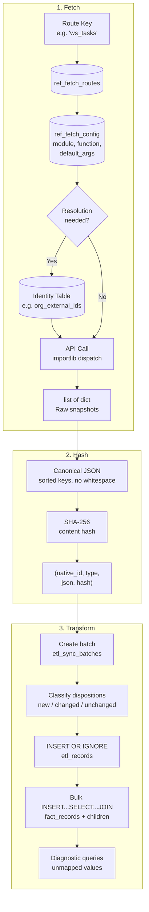

# ETL Pipeline Overview

How grant data flows from external sources to structured, searchable records. The pipeline is fully config-driven — adding a new data source requires only database rows, not Python changes.

## Pipeline Flow



## Module 1: FetchDispatcher

**Purpose:** Resolve a route key (like `'ws_tasks'` or `'bl_notes'` -- references to external sources of business records) to an actual API call, using database configuration instead of hardcoded dispatch logic.

**How it works:**

1. Look up the route key in `ref_fetch_routes` → get a `ref_fetch_config` row
2. The config row specifies: `module` (importlib path), `function` (callable name), `default_args` (JSON dict merged with caller kwargs)
3. If `resolution_table` is set, perform pre-fetch ID translation (e.g., convert an internal identifier to a CRM-specific identifier key by querying `org_external_ids`)
4. Call the function via `importlib.import_module()`, normalize the result to `list[dict]`

**Key design choice:** The dispatcher handles two return shapes transparently — objects with `.to_dict()` (from the Google Sheets integration) and plain dicts (from the CRM API). This normalization happens in `_call_source()`:

The value of this indirection is that the system can have a modular, agnostic attitude towards a variety of data sources, including tabular and JSON data from any number of providers. Per provider, a module and function can be loosly defined to then allow programmatic and repeatable access without significant changes to the codebase.

```python
def _call_source(module: str, function: str, **kwargs) -> list[dict]:
    mod = importlib.import_module(module)
    fn = getattr(mod, function)
    results = fn(**kwargs)

    normalized = []
    for item in results:
        if hasattr(item, "to_dict"):
            normalized.append(item.to_dict())
        else:
            normalized.append(item)
    return normalized
```

When a route needs data from a CRM, the caller knows the internal organization ID but the API needs the CRM's own ID. Rather than hardcoding this translation, the config row points to a resolution table:

```
ref_fetch_config row:
  resolution_table  = "org_external_ids"
  resolution_input  = "bernie_id"       ← caller kwarg to match on
  resolution_output = "cid"             ← kwarg to inject into API call
  resolution_filter = {"system":"bloomerang", "id_type":"api_cid"}
```

The dispatcher queries the resolution table, injects the resolved value, and removes the original kwarg — all driven by config, no code changes needed per source.

## Module 2: SnapshotHasher

**Purpose:** Convert raw API dicts into tuples ready for SQL staging, with content-based deduplication.

**How it works:**

1. For each record dict, extract a `source_native_id` (via a caller-provided function)
2. Serialize to canonical JSON (keys sorted, no whitespace, dates/decimals stringified)
3. Compute SHA-256 hash of the canonical form
4. Return `(native_id, record_type, snapshot_json, content_hash)` tuples

**Key design choice:** Routing metadata (injected by the caller for context) is excluded from the hash. This prevents false "changed" classifications when the same source record is fetched through different routes:

```python
_HASH_EXCLUDE_KEYS = frozenset({"bernie_number"})

def compute_content_hash(data: dict) -> str:
    if _HASH_EXCLUDE_KEYS.isdisjoint(data):
        hashable = data
    else:
        hashable = {k: v for k, v in data.items() if k not in _HASH_EXCLUDE_KEYS}
    canonical = json.dumps(hashable, sort_keys=True, separators=(',', ':'), default=str)
    return hashlib.sha256(canonical.encode('utf-8')).hexdigest()
```

The hash is computed in Python because SQLite has no built-in SHA-256. The `etl_records` table has a `UNIQUE(source_native_id, content_hash)` constraint, so `INSERT OR IGNORE` naturally deduplicates unchanged records.

## Module 3: TransformCoordinator

**Purpose:** Stage hashed tuples into `etl_records` and decompose them into the fact table hierarchy — all in one database transaction.

Uses **bulk `INSERT...SELECT...JOIN`** statements that leverage configuration tables as SQL join partners, replacing what would traditionally be per-record Python loops.

**The key pattern:** Dynamic JSON extraction via field routing tables:

```sql
-- Extract a field value using config-driven JSON path
json_extract(er.snapshot_json, '$.' || rf.source_key)

-- Full pattern: INSERT child fact rows by JOINing
-- etl_records (data) with ref_field_routing (config)
INSERT INTO fact_titles (fact_record_id, title)
SELECT fr.id, NULLIF(TRIM(json_extract(er.snapshot_json, '$.' || rf.source_key)), '')
FROM fact_records fr
JOIN etl_records er ON er.id = fr.etl_id
JOIN ref_field_routing rf
    ON rf.record_type = er.record_type AND rf.app_field = 'title'
WHERE er.etl_batch_id = ?
```

`ref_field_routing` tells the system: "for `ws_task` records, the `title` field lives at JSON path `$.task_name`; for `bl_note` records, it's at `$.subject`." The SQL handles both with the same statement.

**Transaction structure:**

```
BEGIN TRANSACTION
  1. Classify dispositions (new/changed/unchanged) by checking existing etl_records
  2. Write batch manifest (for deletion detection)
  3. INSERT OR IGNORE into etl_records (dedup via content hash)
  4. INSERT fact_records headers (multi-JOIN: field routing + type mappings + staff lookup)
  5. INSERT child fact tables (statuses, titles, dates, amounts, programs, notes)
  6. INSERT actionable_records (for record types configured as default-actionable)
COMMIT
  7. Run diagnostic queries (unmapped statuses, unregistered funders) — logged as warnings
```

**Composable SQL builders** reduce duplication across the child table inserts:

```python
def _field_to_single_col(table, column, app_field, value_expr, null_filter):
    """Build INSERT...SELECT for a single-column child fact table."""
    from_clause = _FROM_FACT_FIELD.format(app_field=app_field)
    return f"""INSERT INTO {table} (fact_record_id, {column})
SELECT fr.id, {value_expr}{from_clause}
  AND {null_filter}"""
```

**Status canonicalization** uses `ref_status_mappings` as a JOIN partner. Source systems use different vocabularies ("1. Awarded", "Awarded", "awarded") — the mapping table normalizes them:

```sql
INSERT INTO fact_statuses (fact_record_id, status)
SELECT sr.fact_record_id, rsm.canonical_status
FROM status_raw sr
JOIN ref_status_mappings rsm
    ON rsm.source_value = CASE
        WHEN INSTR(sr.raw_val, '. ') > 0
        THEN SUBSTR(sr.raw_val, INSTR(sr.raw_val, '. ') + 2)
        ELSE sr.raw_val
    END
```

**Deletion detection** uses a batch manifest pattern. For bulk-fetched sources, the complete record list comes in each fetch. The manifest records which `source_native_ids` appeared in each batch. Records absent from all recent batches are marked `removed_from_source` — they're preserved for historical queries but drop out of active workflow views.

## Result Tracking

Every `stage_and_transform()` call returns a `TransformResult` — an immutable summary:

```python
@dataclass(frozen=True, slots=True)
class TransformResult:
    success: bool
    error: Optional[str] = None
    batch_id: int = 0
    records_processed: int = 0    # new + changed
    records_skipped: int = 0      # unchanged (same content hash)
    records_failed: int = 0
    facts_written: int = 0        # total child fact rows created
    records_removed: int = 0      # marked as removed from source
```

## Adding a New Data Source

To integrate a new external system, you need:

1. **One row in `ref_fetch_config`** — module path, function name, default args, native ID key
2. **Rows in `ref_field_routing`** — map the source's JSON keys to app fields (title, status, deadline, etc.)
3. **Rows in `ref_status_mappings`** — map the source's status vocabulary to canonical statuses
4. **Optionally, rows in `ref_program_mappings`** — if the source has program/category fields

No Python code changes. The ETL pipeline discovers the new source through its configuration tables.
